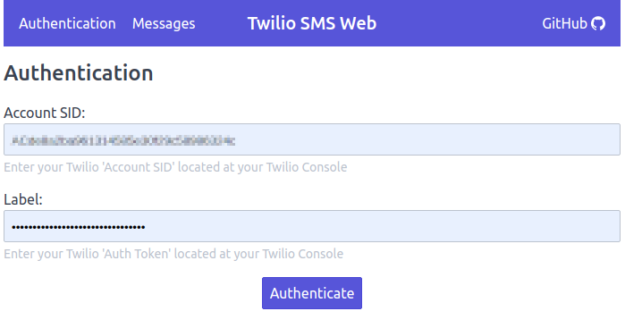
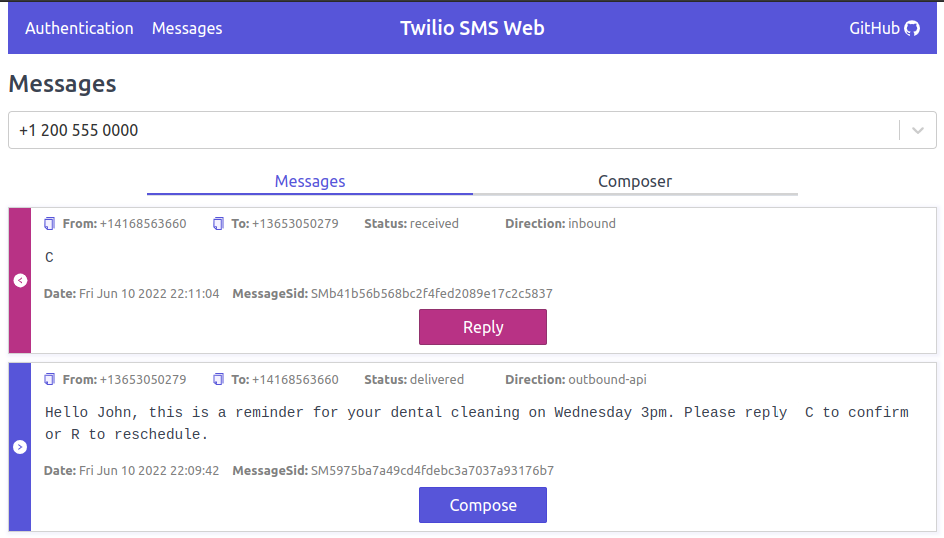
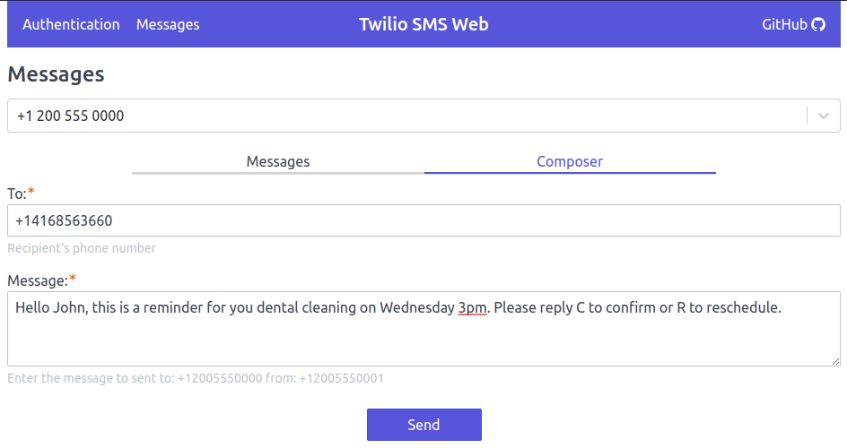

# Twilio SMS Web

A minimalist web application to send and read SMS messages via Twilio.

# Hosted Application

A version of this application is available on GitHub Pages:

https://rafacandev.github.io/twilio-sms-web

# Twilio Account

You will need a Twilio account to read and send SMS messages.

## Twilio Free Account

If you don't have an account, Twilio offers a [free trial account][TwilioFreeTrial].
Once your account is created you will need to [verify your personal phone number][TwilioVerifyPersonalPhoneNumber].
Finally, you also need to [get a Twilio phone number with SMS capability][TwilioGetPhoneNumber].

## Sign-in to Twilio SMS Web

1. Sign-in to Twilio and get your `ACCOUNT SID` and `AUTH TOKEN` on the [Twilio's Console Page][TwilioConsole].
2. Use your `ACCOUNT SID` and `AUTH TOKEN` to sign-in to [Twilio SMS Web][HostedDemo].

# Screenshots

Sign-in



Read messages:



Compose messages:



# Development

## NodeJs

We recommend using Node Version Manager that we can consistently align versions.

```
# On the first time
nvm install
# On subsequent times
nvm use
```

## Available Scripts

In the project directory, you can run:

## `npm start`

Runs the app in the development mode.
Open [http://localhost:3000](http://localhost:3000) to view it in the browser.

The page will reload if you make edits.
You will also see any lint errors in the console.

## `npm run build`

It bundles React in production mode and optimizes the build for the best performance in the `build` folder.

A varient `npm run build:prod` is also available which is going to override the `.env` file with the values from a `.env-prod`.

## `npm run deploy`

Intended to be used after `npm run build:prod`.
It deploys the content from the `/build` folder to: https://rafacandev.github.io/twilio-sms-web/

## Environment Variables

This project uses [dotenv](https://github.com/motdotla/dotenv) to manage environment variables.
Developers can change these values according to their needs via environment variables or editing the `.env` file.

Sample `.env` file:

```
# When this value is populated, then Google Tag Manager is going to be enabled with this publicId, i.e: GTM-0000000
REACT_APP_GOOGLE_TAG_MANAGER_ID=GTM-0000000

# Include your authentication info for auto sign-in
REACT_APP_AUTHENTICATION_ACCOUNT_SID=ACxxxxxxxxxxxxxxxxxxxx
REACT_APP_AUTHENTICATION_API_KEY=SKxxxxxxxxxxxxxxxxxxxx
REACT_APP_AUTHENTICATION_API_SECRET=xxxxxxxxxxxxxxxxxxxx
```

`.env` files should be managed independently and they should not be pushed to the codebase repository.

[HostedDemo]: https://rafacandev.github.io/twilio-sms-web/#/
[TwilioConsole]: https://www.twilio.com/console?
[TwilioFreeTrial]: https://www.twilio.com/docs/usage/tutorials/how-to-use-your-free-trial-account
[TwilioVerifyPersonalPhoneNumber]: https://www.twilio.com/docs/usage/tutorials/how-to-use-your-free-trial-account#verify-your-personal-phone-number
[TwilioGetPhoneNumber]: https://www.twilio.com/docs/usage/tutorials/how-to-use-your-free-trial-account#get-your-first-twilio-phone-number
